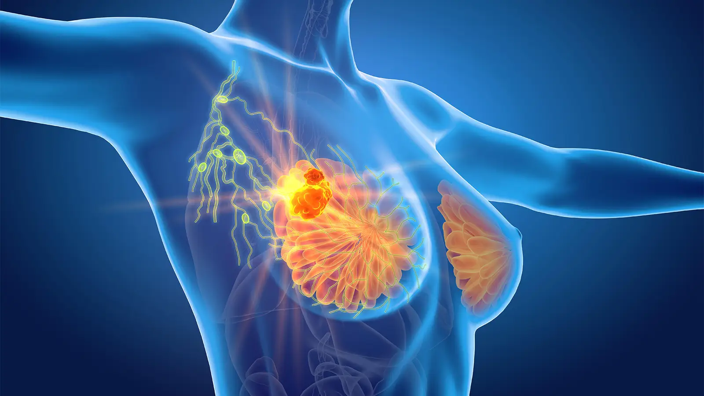

# Breast Cancer Diagnosis by Causal_inference



'''
Dashboard: Demo 
https://ammon21.github.io/Causal-Inference/

'''
**Table of content**

- [Introduction](#introduction)
- [Overview](#overview)
- [Install](#install)
- [Data](#data)
- [Notebooks](#notebooks)
- [Scripts](#scripts)
- [Test](#test)
- [Author](#Author)

## Introduction

> Breast-cancer Diagnostic The second greatest cause of cancer death in women, after lung cancer, is breast cancer, which is the most prevalent invasive cancer in females. Since 1989, significant progress has been made in the detection and treatment of breast cancer. More than 3.1 million Americans have survived breast cancer, according to the American Cancer Society (ACS). About 1 in 38 women will develop breast cancer in their lifetime (2.6 percent ).


<hr>

# Overview

> The purpose of this project is to extract useful features by using causal inferences and building the model to predict the diagnosis. The causal graph is a central object in the framework mentioned above, but it is often unknown, subject to personal knowledge and bias, or loosely connected to the available data. The main objective of the task is to highlight the importance of the matter in a concrete way. In this spirit, trainees are expected to attempt the following tasks:

        1) Perform a causal inference task using Pearl’s framework
        2)  Infer the causal graph from observational data and then validate the graph
        3)  Merge machine learning with causal inference

<hr>

## Install

```bash
git clone https://github.com/Ammon21/Causal-Inference.git
cd Causal-Inference
sudo python3 setup.py install
```

<hr>

## Data

 > I extracted the data from kaggle. i downloaded and put it in my repository data folder. i was  provided with a csv file with 31 features including the target variable diagnosis. Features in the data are computed from a digitized image of a fine needle aspirate (FNA) of a breast mass.

 Data can be found [here at the UCI, machine learning](https://archive.ics.uci.edu/ml/datasets/Breast+Cancer+Wisconsin+%28Diagnostic%29), and or [here at Kaggle](https://www.kaggle.com/datasets/uciml/breast-cancer-wisconsin-data)

 <hr>

## [notebooks](notebooks):

> `notebooks`: a jupyter notebook for preprocessing the data.
   All the analysis and examples of implementation will be here in the form of .ipynb file

## [scripts](scripts):

> `scripts/`: folder where modules are stored. 

## [tests](tests):

> `tests/`: the folder containing unit tests for the scripts.

## Author

👤 **Ammon Leulesged**

- GitHub: [Ammon Leuleseged](https://github.com/Ammon21)
- LinkedIn: [Ammon Leuleseged](https://www.linkedin.com/in/ammon-leulseged-3502a3205/)


